# JavaBabySteps
First attempts to creating java programs.

## [Step 1](src/step1.java) - Hello world program
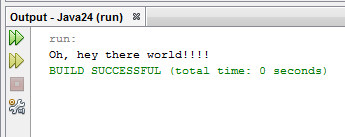

## [Step 2](src/step2.java) - Finding the square root of a number
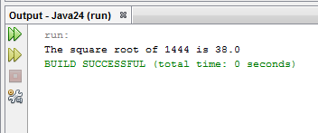

## [Step 3](src/step3.java) - Blank filler with arguments
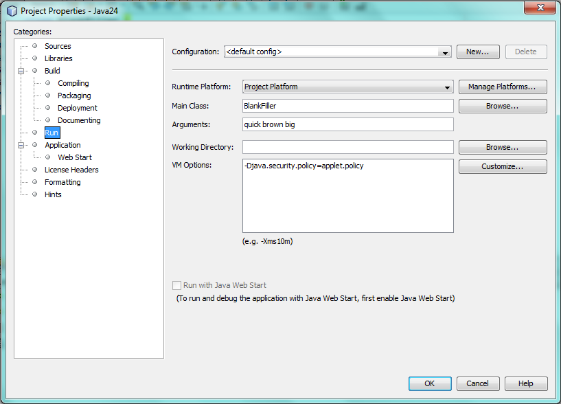
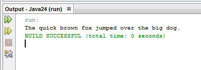

## [Step 4](src/step4.java) - Applet for finding the square root
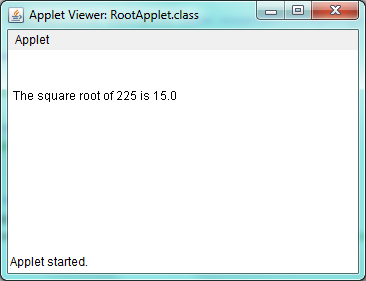

## [Step 5](src/step5.java) - Finding the square root with arguments
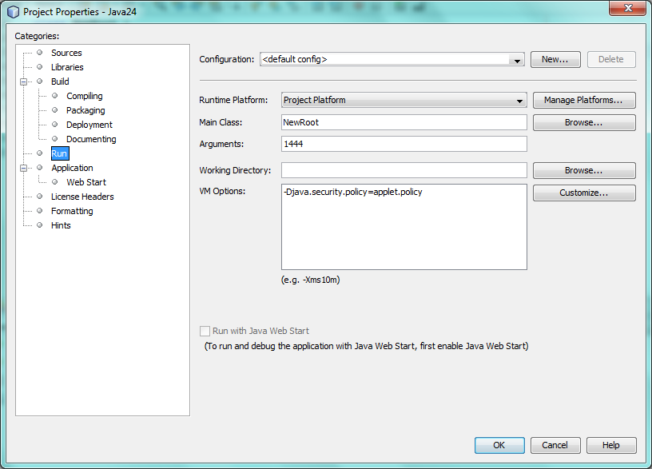
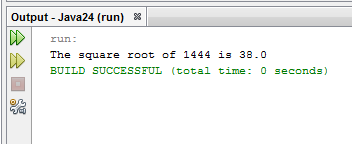

## [Step 6](src/step6.java) - Exploring java variables
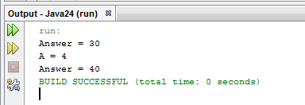

## [Step 7](src/step7.java) - Weight converter in various planets
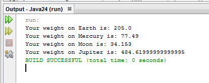

## [Step 8](src/step8.java) - Displaying the credits of a movie
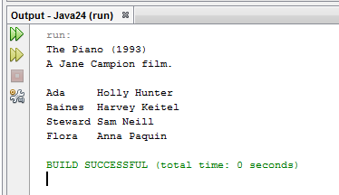

## [Step 9](src/step9.java) - Introducing if statements via two simple game examples
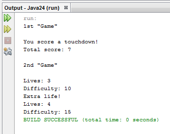

## [Step 10](src/step10.java) - Commodity
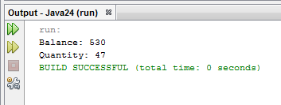

## [Step 11](src/step11.java) - Clock
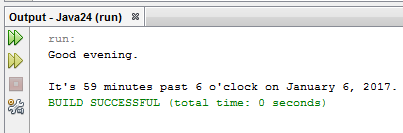

## [Step 12](src/step12.java) - Multiples of Nine
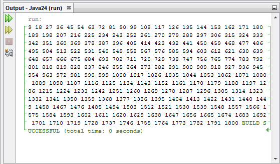

## [Step 13](src/step13.java) - Benchmark
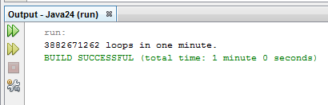

## [Step 14](src/step14.java) - Space remover
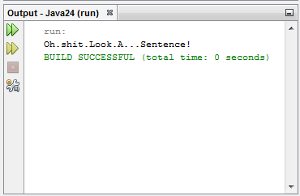

## [Step 15](src/step15.java) - Sorting a table that contains names
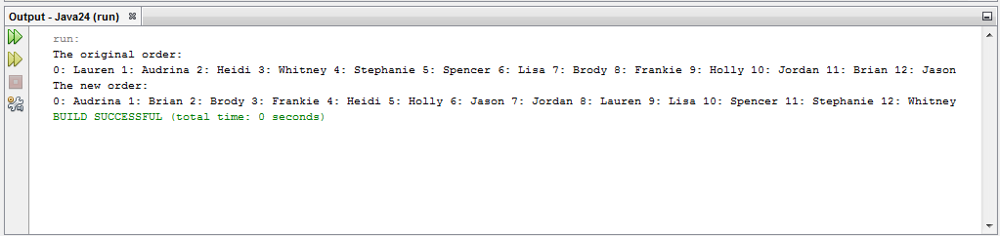

## [Step 16](src/step16.java) - Letter frequency counter
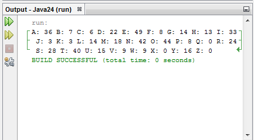

## [Step 17](src/step17.java) - Finding the square root with arguments
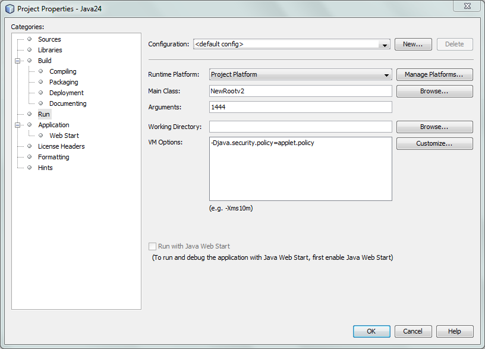
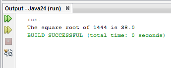

## [Step 18](src/step18.java) - Creating a modem tester... sort of...
Classes used in this step
- [Modem class](src/step18a.java)
- [CableModem class](src/step18b.java)
- [DslModem class](src/step18c.java)
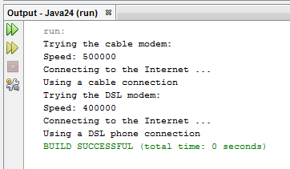

## [Step 19](src/step19.java) - Creating an acoustic modem tester... sort of...
Classes used in this step
- [Acoustic Modem class](src/step19a.java)
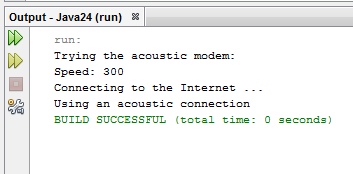
